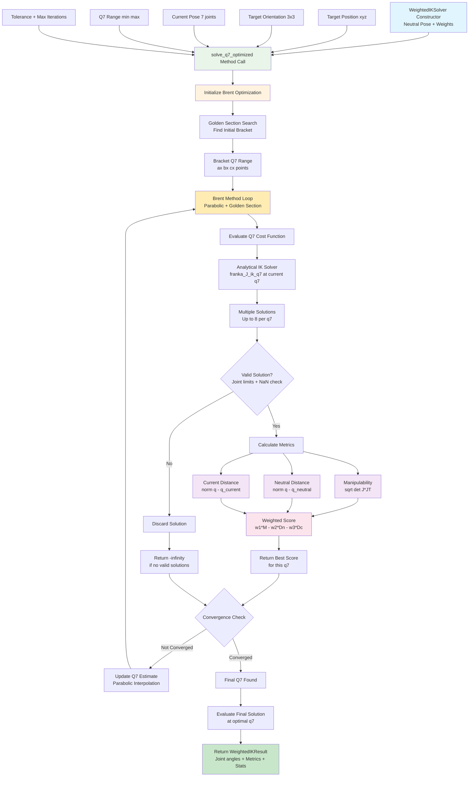
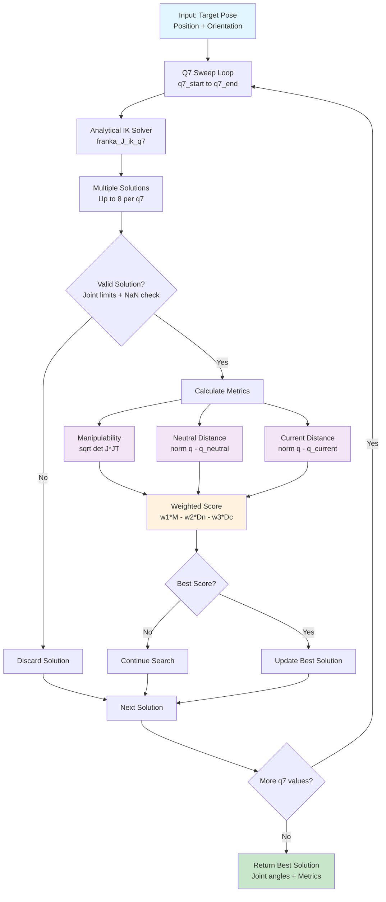
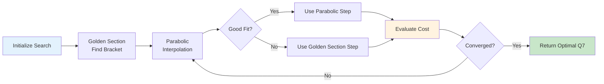
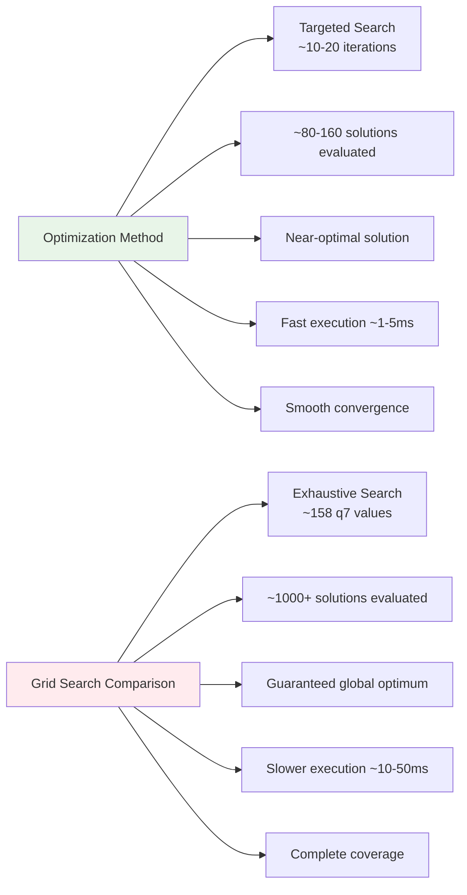

# Weighted IK Summary

The `weighted_ik` module provides an intelligent inverse kinematics solver that optimizes robot configurations based on multiple criteria using efficient 1D optimization instead of exhaustive search.

## System Architecture

## Grid Search Flowchart

## Key Features

### Multi-Objective Optimization
- **Manipulability**: Maximizes robot dexterity (avoids singular configurations)
- **Neutral Distance**: Minimizes deviation from robot's neutral/home pose  
- **Current Distance**: Minimizes joint movement from current configuration

### Optimization-Based Solving
1. **Primary Method** (`solve_q7_optimized`): Uses Brent's method for efficient 1D optimization
2. **Fallback Method** (`solve_q7`): Grid search available for comparison/debugging

### Algorithms
- **Brent's Method**: Combines parabolic interpolation with golden section search
- **Automatic Bracketing**: Finds optimal search interval automatically
- **Convergence Control**: Configurable tolerance and iteration limits
- **Robust Handling**: Gracefully handles discontinuous cost functions

## Optimization Process

## Performance Advantages

