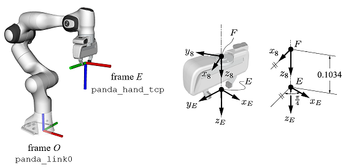

# GeoFIK: A fast and reliable geometric IK solver for the Franka arm

**GeoFIK** (**Geo**metric **F**ranka **IK**) is an analytical geometric solver for the inverse kinematics (IK) of the Franka arm. GeoFIK has the following advantages over other solvers:
* GeoFIK is ultra fast! It is an analytical solver, so the computational time in the order of tens of microseconds on standard laptops. This is much faster than numerical solvers and, according to our experiments, also faster than the algebraic analytical solvers generated by IKFast.
* Unlike other analytical solvers, GeoFIK provides four different ways to resolve the 1-DOF redundancy of the Franka arm. Functions that solve the IK using q7, q6, q4 or the swivel angle as free variables are provided. 
* Before computing the joint angles, GeoFIK finds the entire geometry of the arm by calculating the screw axes of the joints. Hence, the Jacobian matrices for each IK solution are returned at no significan extra computational cost.
* Due to its geometric nature, all possible solutions for the IK problem are found. We proved that the maximum numer is 8. Joint limits are checked before returning the solutions.

For detailed information about the implementation, tests and experiments, see the preprint of our paper [arXiv:2503.03992v1](https://arxiv.org/abs/2503.03992v1).

## Usage

### World and end-effector frames

GeoFIK uses frame $$E$$ as end-effector frame, and frame $$O$$ as world frame, as shown in the picture below. In [franka_ros](https://frankaemika.github.io/docs/franka_ros.html) $$E$$ and $$O$$ are named `panda_hand_tcp` and `panda_link0`, respectively. 

 

Some applications, especially when the gripper is removed, may use the flage frame 8 (`panda_link8_sc`) also called $$F$$ as end-effector frame. The transformation between this frame and frame $$E$$ is shown in the figure above and can be represented by the following transformation matrix $${}^{8}\_{E}$$𝐓: 
```
T8E = [[ 0.70710678  0.70710678  0.          0.        ]
       [-0.70710678  0.70710678  0.          0.        ]
       [ 0.          0.          1.          0.1034    ]
       [ 0.          0.          0.          1.       ]]
```
Therefore, when working with frame 8, given a desired pose, $${}^{O}\_{8}$$𝐓, the solver must be called with $${}^{O}\_{E}$$𝐓 = $${}^{O}\_{8}$$𝐓 $${}^{8}\_{E}$$𝐓.

### Functions provided


